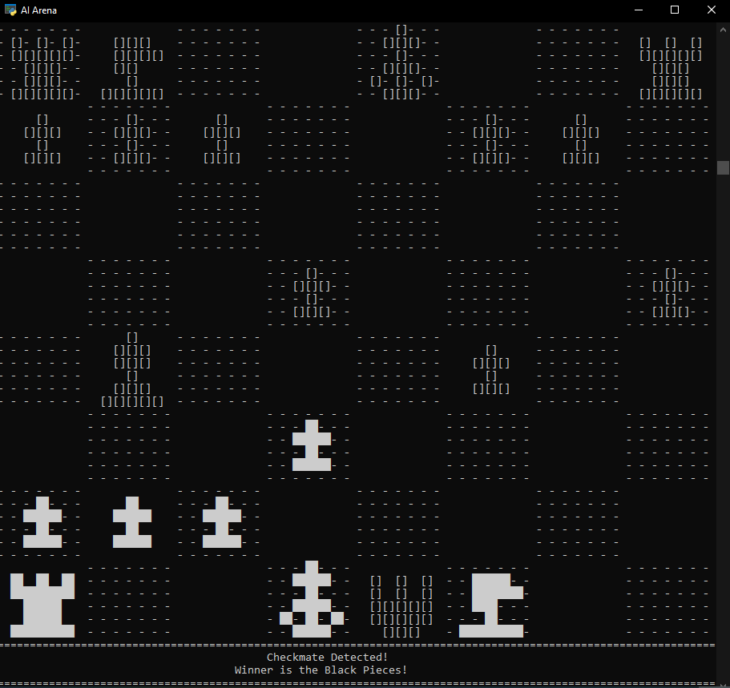

# Chess!

# Introductory Banter:

- This uses a custom set of display functions that uses the Windows CMD to display the game. On smaller screens, the top board row might not fully show.

- It is worth noting that when running the game via the "Start Game" bat file (it just simply launchs 'Game Controller.py', you will first be prompted if you want AI to play against. If you don't want to play with AIs, simply press enter or type no.

# Controls and Such:

- Don't move the CMD when it starts up and resizes! To enable the following controls, It must be at a particular part of the screen, with its particular size.

- Right-click is your friend. Either select a piece with right click or right click again anywhere where there's not an avalible move to unselect the piece (possible moves will be highlighted for you). If you select a piece that has no moves, it will be automatically deselected and the game will be ready for you to select a different piece.

# Other Misc:

- When a checkmate scenario is detected the screen will no longer print frames of the chess game and instead will give a message saying checkmate was detected and which player won.

- The same goes for a stalemate scenario. Also, if only kings are left on the board, a stalemate scenario is called. Not sure why someone would keep playing in that case.

- It should be relatively obvious which pieces are the white ones and which are the black ones. I did the best I could with the graphics!

- Check the releases for the current game status and/or bugs.

# Technicals:

- Since V1.5, "LaunchSideWindow.bat" marks the first extra bat file. This one also simply launches a seperate program (SideWindow.py) to open another cmd screen for the evalution bar on the side of the game window.
  - To make this work, I now have to store a small cache of variables in the folder the game files are located in. Currently there is "Board.npy", "Eval.npy", and "Player.npy". This made it very convenient to make new complex additions to the game, like the evaluation bar program running in parallel with the game
